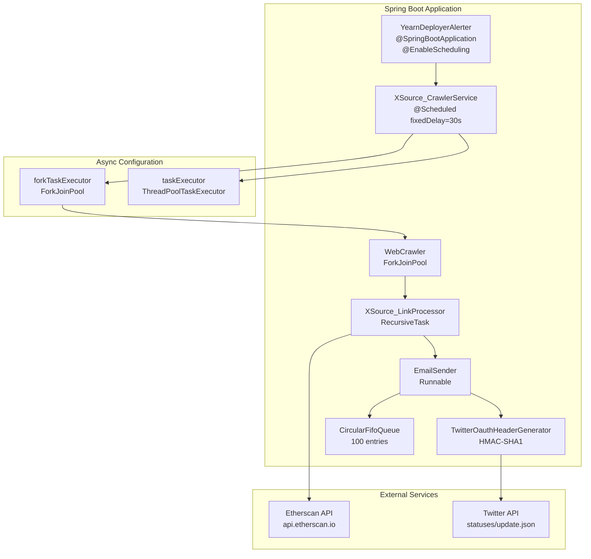
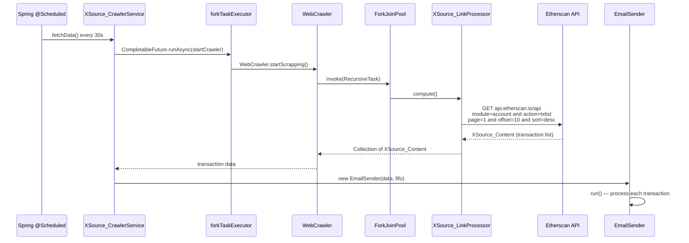
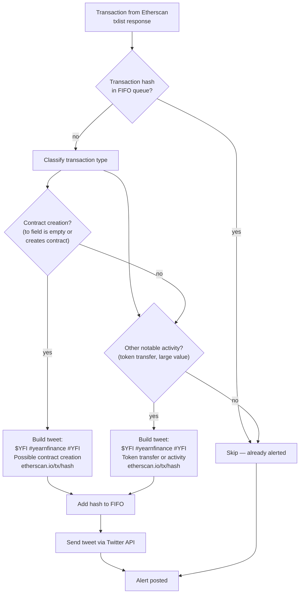
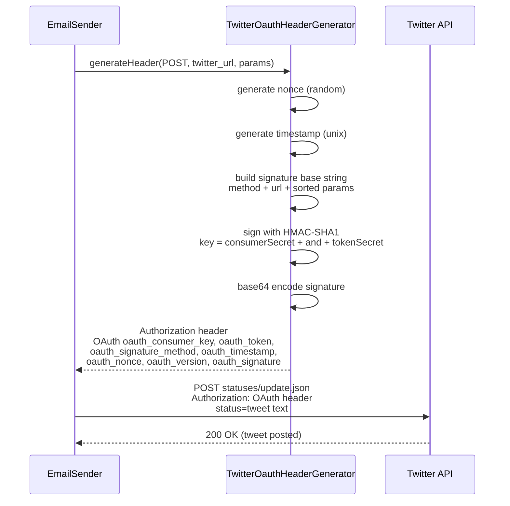
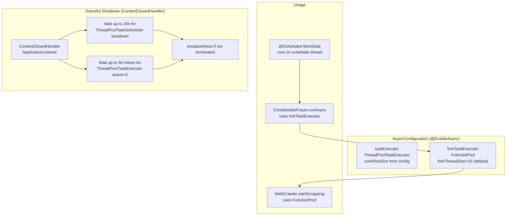
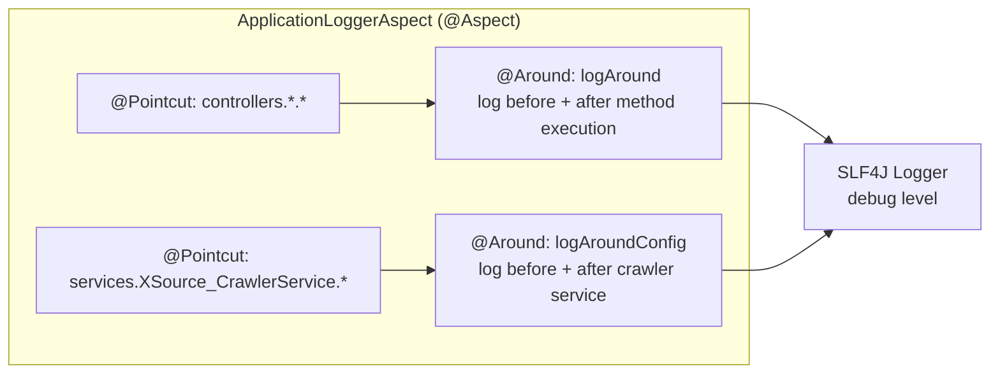

# YearnDeployerAlerterBot — Architecture

> A Spring Boot bot that monitors Yearn Finance deployer activity on Etherscan and auto-posts alerts to Twitter. It scrapes Etherscan's API at a fixed interval, detects contract creation and token transfer events, and tweets them with deduplication via a circular FIFO queue.

| | |
|---|---|
| **Language** | Java 8 |
| **Framework** | Spring Boot 2.1.4 · Spring Data JPA · Spring Scheduling |
| **Scraping** | Jsoup + RestTemplate (Etherscan API) |
| **Concurrency** | ForkJoinPool for crawling · ThreadPoolTaskExecutor for async |
| **Twitter** | OAuth 1.0a (HMAC-SHA1 signing via TwitterOauthHeaderGenerator) |
| **Deduplication** | CircularFifoQueue (100-entry window) |
| **Database** | H2 (runtime, dev) · PostgreSQL (production) |
| **AOP** | ApplicationLoggerAspect — logs controllers and crawler service |

---

## High-Level Architecture

---

## Scheduled Crawl Cycle

---

## Alert Decision Flow

For each transaction from Etherscan, the bot decides whether to tweet. Deduplication uses a `CircularFifoQueue` of 100 transaction hashes.

---

## Twitter OAuth 1.0a Signing

The bot uses manual OAuth 1.0a header generation with HMAC-SHA1 signing — no Twitter SDK dependency.

---

## Async Thread Pool Architecture

---

## AOP Logging

The aspect intercepts all controller methods (`com.azad.yearn.deployer.controllers.*`) and the crawler service (`XSource_CrawlerService`), logging method entry, arguments, and exit at debug level.
